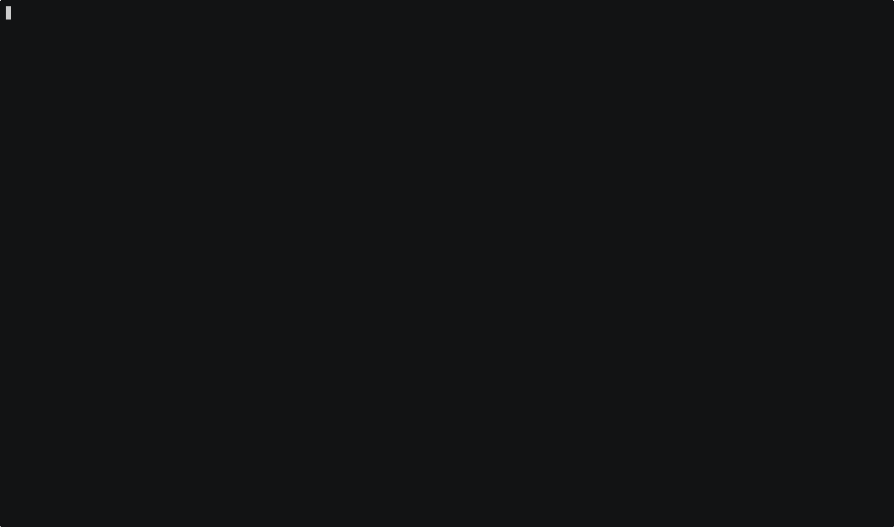

# amux — terminal multiplexer for human+agent workflows

[](https://github.com/weill-labs/amux/actions/workflows/ci.yml)
[](https://codecov.io/gh/weill-labs/amux)

*Picture a terminal split into panes — each running an agent, possibly on a different machine. Can one agent reliably command another, wait for the result, and read it back, while the human watches it all happen?*

GUIs force screenshots and vision models. Headless APIs cut the human out. **amux** is a shared TUI grid where humans use keybindings and agents use CLI commands. Same panes, same state.

Structured JSON capture, blocking waits, and push-based events — no polling, no screen-scraping.



## How it works

The VT emulator's parsed state is the source of truth, rendered two ways:

```
PTY output (raw bytes)
       ↓
   VT emulator (parsed state) ← source of truth
       ↓                ↓
  ANSI rendering    structured output
  (for humans)      (for agents)
```

Retained pane history is server-owned. Clients hydrate that history on attach and keep their own local copy-mode state (scroll position, search, selection) on top of it. That means history survives detach/reattach, hot reload, and crash recovery, while each viewer can still browse independently. Crash recovery restores a fresh shell for each local pane; retained history always survives, and the last visible screen is only replayed when the checkpointed pane was already idle at a shell prompt.

## Install

```bash
go install github.com/weill-labs/amux@latest
```

On first server start, `amux` installs its `amux` terminfo entry into `~/.terminfo`.
This requires `tic` from ncurses. You can also run it explicitly:

```bash
amux install-terminfo
```

## Quick Start

**Human**

```bash
# Start or reattach to the main session
amux

# Or create a named session
amux new my-project

# Or attach to an existing named session
amux -s my-project attach
```

**Agent**

```bash
# Inspect the current session
amux capture --format json

# Capture the full browsable buffer for one pane
amux capture --history pane-1

# Send a command to a pane and wait for it to finish
amux send-keys pane-1 "ls" Enter
amux wait idle pane-1

# Broadcast the same command to multiple panes
amux broadcast --panes pane-1,pane-2 "make test" Enter

# Send a task to an agent pane after it reaches its prompt
amux send-keys pane-31 --wait ready "Fix the auth timeout bug" Enter

# Delegate a prompt without stealing focus from your current pane
amux delegate pane-31 "Summarize the failing tests and propose a fix"

# Subscribe to state changes
amux events --filter idle

# Tag the current pane when you start a Linear issue
scripts/set-pane-issue.sh LAB-445

# Find worker PRs with failing CI and see which pane owns each one
scripts/check-worker-ci.sh

# Discover attached clients
amux list-clients

# Inspect recent client attach/detach history
amux connection-log
```

## Agent API

Every operation is a single CLI call — no libraries, no SDK, language-agnostic.

### Structured Capture

Capture the full session state as structured JSON:

```bash
amux capture --format json
```

Returns a JSON object with session metadata, window info, and per-pane state:

```json
{
  "session": "my-project",
  "window": {"id": 1, "name": "main", "index": 1},
  "width": 200, "height": 50,
  "panes": [
    {
      "id": 1,
      "name": "pane-1",
      "active": true,
      "zoomed": false,
      "host": "local",
      "task": "",
      "meta": {
        "prs": [42],
        "issues": ["LAB-338"]
      },
      "color": "f5e0dc",
      "position": {"x": 0, "y": 0, "width": 100, "height": 49},
      "cursor": {"col": 12, "row": 24, "hidden": false},
      "content": ["$ make test", "PASS", "ok  github.com/weill-labs/amux 5.432s", "$ ▊"],
      "idle": true,
      "idle_since": "2025-06-15T10:30:00Z",
      "current_command": "bash",
      "child_pids": []
    }
  ]
}
```

Pane JSON includes a nested `meta` object for user-managed metadata: `task`, `git_branch`, `pr`, tracked `prs`, and tracked `issues`. The legacy top-level `task`, `git_branch`, and `pr` fields remain for compatibility.

Capture a single pane:

```bash
amux capture --format json pane-1
```

History-aware pane capture:

```bash
amux capture pane-1
amux capture --history pane-1
amux capture --history --rewrap 120 pane-1
amux capture --history --format json pane-1
amux capture --history --rewrap 120 --format json pane-1
```

`capture pane-1` returns the pane's current visible screen. `capture --history pane-1` returns the full browsable buffer for that pane: retained scrollback followed by the current screen. `capture --history --rewrap WIDTH pane-1` best-effort reconstructs narrow-pane rows at a wider width, which is useful when agent output was captured in dense layouts. The JSON form keeps history and visible content separate as `history` and `content`, and `--rewrap` applies there too. By default amux retains up to `10000` scrollback lines per pane; override that with `scrollback_lines` in `config.toml`. After crash recovery, `history` includes any archived pre-crash visible screen from panes whose foreground process was lost.

`--rewrap` is exact for live rows captured in the current process lifetime, where amux tracks the width each scrollback row was wrapped at. Restored/base history from attach bootstrap, reload checkpoints, and crash checkpoints is still stored as raw text rows, so rewrap can only improve live rows and current visible content. Hard newlines that happened exactly at pane width remain ambiguous without tmux-style wrapped-line metadata.

Because retained history is server-owned, `capture --history` works after detach/reattach, after `reload-server`, and after crash recovery, and it does not require an attached interactive client. Copy mode remains per-client UI state over that shared history.

### Wait Commands

Block until a condition is met. No polling.

| Command | Description | Default timeout |
|---------|-------------|-----------------|
| `wait idle <pane>` | Block until pane has no foreground process | 5s |
| `wait vt-idle <pane>` | Block until pane terminal output settles | 60s |
| `wait busy <pane>` | Block until pane has a child process | 5s |
| `wait content <pane> <substring>` | Block until substring appears in pane content | 10s |
| `wait ready <pane>` | Block until pane VT output settles and no child processes remain | 10s |
| `wait layout [--after N]` | Block until layout generation exceeds N | 3s |
| `wait clipboard [--after N]` | Block until clipboard content changes | 3s |
| `wait checkpoint [--after N]` | Block until a crash checkpoint write completes | 15s |
| `wait ui <event> [--client client-1] [--after N]` | Block until a client-local UI state is reached | 5s |
| `cursor layout` | Show the current layout cursor | n/a |
| `cursor clipboard` | Show the current clipboard cursor | n/a |
| `cursor ui [--client client-1]` | Show the current client UI cursor | n/a |

`wait vt-idle` also accepts `--settle <duration>` (default `2s`). All wait commands accept `--timeout <duration>` (e.g., `--timeout 30s`).

`wait ready` is the conjunction of `wait vt-idle` and `wait idle`: the visible screen has stopped changing and the pane has no foreground child processes. It does not inspect prompt text, so custom shell prompts work the same as agent prompts.

### Event Stream

Subscribe to real-time session events as NDJSON:

```bash
amux events [--filter layout,idle,busy,vt-idle,client-connect,client-disconnect,display-panes-shown,choose-window-shown] [--pane pane-1] [--host lambda-a100] [--client client-1] [--throttle 50ms] [--no-reconnect]
```

Use `amux list-clients` to discover attached client IDs for `--client` and `wait ui`.

```json
{"type":"layout","ts":"2025-06-15T10:30:00.123Z","generation":42,"active_pane":"pane-1"}
{"type":"idle","ts":"2025-06-15T10:30:01.456Z","pane_id":2,"pane_name":"pane-2","host":"lambda-a100"}
{"type":"busy","ts":"2025-06-15T10:30:05.789Z","pane_id":2,"pane_name":"pane-2","host":"lambda-a100"}
{"type":"vt-idle","ts":"2025-06-15T10:30:05.850Z","pane_id":2,"pane_name":"pane-2","host":"lambda-a100"}
{"type":"client-connect","ts":"2025-06-15T10:30:05.900Z","client_id":"client-2"}
{"type":"client-disconnect","ts":"2025-06-15T10:30:06.000Z","client_id":"client-2","reason":"explicit-detach"}
{"type":"reconnect","ts":"2025-06-15T10:30:06.000Z"}
```

Event types: `layout`, `output`, `idle`, `busy`, `vt-idle`, `client-connect`, `client-disconnect`, and the client-generated `reconnect` event used by the CLI auto-reconnect path. By default `amux events` reconnects automatically after a dropped stream, emits a client-generated `reconnect` event, and resubscribes after exponential backoff. Use `--no-reconnect` for scripts that want exit-on-disconnect. New subscribers receive the current state as an initial snapshot, including already-attached clients as `client-connect` events, so no events are missed between subscribe and the first real event. Output events are throttled to at most one per pane per `--throttle` interval (default 50ms). Non-output events pass through immediately. Use `--throttle 0s` to disable throttling. `vt-idle` uses a fixed `2s` settle window in the stream.

### Agent Loop Example

```bash
#!/usr/bin/env bash
# Agent loop: run a command, wait for it to finish, inspect the result.

PANE="pane-1"

# 1. Send a command to the pane
amux send-keys "$PANE" "make test" Enter

# 2. Wait for the command to start (pane becomes busy)
amux wait busy "$PANE" --timeout 5s

# 3. Wait for it to finish (pane becomes idle)
amux wait idle "$PANE" --timeout 120s

# 4. Capture the result as structured JSON
output=$(amux capture --format json "$PANE")

# 5. Parse with jq and decide what to do next
exit_line=$(echo "$output" | jq -r '.panes[0].content[-2]')
if echo "$exit_line" | grep -q "FAIL"; then
  echo "Tests failed — reading output for diagnostics"
  echo "$output" | jq -r '.panes[0].content[]'
else
  echo "Tests passed"
fi
```

## Why amux?

**Why not tmux + scripts?**
`tmux capture-pane` returns raw text with ANSI escape codes. Parsing it requires regex heuristics that break across terminal widths and applications. amux returns structured JSON with metadata (idle state, cursor position, process info, layout coordinates).

**Why not tmux control mode?**
Control mode still delivers raw pane content and requires polling. amux has blocking waits (`wait idle`, `wait content`) and push-based events — an agent subscribes once and reacts to state changes without polling.

**Why not headless (expect/pexpect)?**
Headless tools cut the human out of the loop. Humans and agents work better on a shared screen. Both see the same panes, both can act on them.

**Does amux support all tmux features?**
No, and it doesn't aim to. amux implements what matters for human+agent pairing: splits, windows, zoom, remote hosts, searchable choosers, and the agent API. If you need tmux's full feature set (session groups, advanced hooks), use tmux.

## CLI Reference

All commands accept `-s <session>` to target a specific session. Panes are referenced by name (`pane-1`) or numeric ID (`1`). Prefix matches are also supported.

### Session

| Command | Description |
|---------|-------------|
| `amux` | Start or attach to main session |
| `amux new [name]` | Start a new named session |
| `amux attach [session]` | Attach to a session |
| `amux status` | Show pane/window summary |
| `amux version` | Show build version |
| `amux reload-server` | Hot-reload the server (preserves panes) |

### Pane Management

| Command | Description |
|---------|-------------|
| `amux list [--no-cwd]` | List panes with metadata (including cwd by default) |
| `amux split <pane> [root] [--vertical\|--horizontal] [--name NAME] [--host HOST]` | Split a pane without changing focus (default: horizontal) |
| `amux add-pane [--name NAME] [--host HOST]` | Add a pane in clockwise spiral order without changing focus |
| `amux focus <pane\|direction>` | Focus by name, ID, or direction (left/right/up/down/next) |
| `amux spawn --name NAME [--host HOST] [--task TASK]` | Spawn a new named pane without changing focus |
| `amux zoom [pane]` | Toggle zoom on a pane |
| `amux kill [pane]` | Kill a pane (default: active) |
| `amux send-keys <pane> [--wait ready\|ui=input-idle] [--timeout <duration>] [--delay-final <duration>] [--hex] <keys>...` | Send keystrokes to a pane |
| `amux delegate <pane> [--timeout <duration>] [--start-timeout <duration>] [--hex] <keys>...` | Type a prompt into a pane, submit it, and wait for the agent to start |
| `amux broadcast (--panes <pane,pane,...> \| --window <index\|name> \| --match <glob>) [--hex] <keys>...` | Send the same keystrokes to multiple panes |
| `amux swap <p1> <p2>` | Swap two panes |
| `amux swap forward\|backward` | Swap active pane with neighbor |
| `amux swap-tree <p1> <p2>` | Swap the root-level groups containing two panes |
| `amux move <pane> --before\|--after <target>` | Move a pane before or after another, reordering siblings when they share a split group |
| `amux move-up <pane>` | Move a pane one slot earlier within its split group |
| `amux move-down <pane>` | Move a pane one slot later within its split group |
| `amux move-to <pane> <target>` | Move one pane into the target pane's column, appending at the bottom |
| `amux rotate [--reverse]` | Rotate pane positions |
| `amux copy-mode [pane] [--wait ui=copy-mode-shown] [--timeout <duration>]` | Enter copy/scroll mode |
| `amux set-meta <pane> key=value...` | Set single-value pane metadata (`task`, `branch`, `pr`) |
| `amux add-meta <pane> key=value...` | Add pane metadata values (`pr=NUMBER`, `issue=ID`) |
| `amux rm-meta <pane> key=value...` | Remove pane metadata values (`pr=NUMBER`, `issue=ID`) |
| `amux refresh-meta [pane]` | Refresh tracked PR/issue completion state (default: active pane) |
`move` first checks whether both panes are siblings in the same split group. When they are, it reorders only that group. Otherwise it falls back to the existing root-level-group behavior, so moving `pane-3` can still move an entire column or row when the panes are in different branches.
`move-up` and `move-down` are shorthand for nudging a pane one slot earlier or later within its current split group.
`move-to` instead moves exactly one pane into the target pane's logical column and appends it to the bottom of that stack.
`split`, `spawn`, and `add-pane` are pure layout mutations: they create the pane but do not change focus. Use `amux focus <pane|direction>` when you want a focus change explicitly. When the active pane is zoomed, these commands preserve the zoom and keep the focused pane unchanged.

`add-pane` builds outward in a clockwise spiral. At 1, 4, 9, 16, ... panes the spiral canvas reaches a uniform `N x N` grid. When a lead pane is active, the lead column stays pinned on the left and `add-pane` spirals only within the right subtree.

### Agent API

| Command | Description |
|---------|-------------|
| `amux capture [pane]` | Capture screen output (text) |
| `amux capture --history <pane>` | Capture retained scrollback plus visible screen |
| `amux capture --history --rewrap <width> <pane>` | Best-effort rewrap retained history and visible content to a wider width |
| `amux capture --format json [pane]` | Structured JSON capture |
| `amux capture --history --format json <pane>` | Pane JSON with separate `history` and visible `content` |
| `amux capture --history --rewrap <width> --format json <pane>` | Pane JSON rewrapped to the requested width |
| `amux capture --ansi [pane]` | Capture with ANSI escape codes |
| `amux capture --colors` | Capture border color map |
| `amux wait idle <pane> [--timeout 5s]` | Block until pane becomes idle |
| `amux wait vt-idle <pane> [--settle 2s] [--timeout 60s]` | Block until pane VT output quiesces |
| `amux wait busy <pane> [--timeout 5s]` | Block until pane has child processes |
| `amux wait content <pane> <substring> [--timeout 10s]` | Block until substring appears in pane |
| `amux wait ready <pane> [--timeout 10s]` | Block until pane VT output settles and no child processes remain |
| `amux wait layout [--after N] [--timeout 3s]` | Block until layout generation > N |
| `amux wait clipboard [--after N] [--timeout 3s]` | Block until clipboard content changes |
| `amux wait checkpoint [--after N] [--timeout 15s]` | Block until a crash checkpoint write completes |
| `amux wait ui <event> [--client id] [--after N] [--timeout 5s]` | Block until a client-local UI state is reached |
| `amux cursor ui [--client id]` | Show current client UI generation counter |
| `amux cursor layout` | Show current layout generation counter |
| `amux cursor clipboard` | Show current clipboard generation counter |
| `amux events [--filter type,...] [--pane ref] [--host name] [--client id] [--throttle 50ms] [--no-reconnect]` | Stream events as NDJSON (output throttled, auto-reconnect by default) |
| `amux list-clients` | List attached clients and client-local UI state |
| `amux connection-log` | Show recent client attach/detach history |
| `amux pane-log` | Show recent pane create/exit history with exit cwd, git branch, and reason |

### Windows

| Command | Description |
|---------|-------------|
| `amux new-window [--name NAME]` | Create a new window |
| `amux list-windows` | List all windows |
| `amux select-window <index\|name>` | Switch to a window |
| `amux next-window` | Switch to next window |
| `amux prev-window` | Switch to previous window |
| `amux rename-window <name>` | Rename the active window |
| `amux resize-window <cols> <rows>` | Resize window to given dimensions |

### Remote Hosts

| Command | Description |
|---------|-------------|
| `amux hosts` | List configured remote hosts and connection status |
| `amux split <pane> [root] [--vertical\|--horizontal] [--name NAME] --host HOST` | Split a pane with a remote pane on HOST without changing focus |
| `amux add-pane [--name NAME] --host HOST` | Add a remote pane in clockwise spiral order without changing focus |
| `amux disconnect <host>` | Drop SSH connection to a host |
| `amux reconnect <host>` | Reconnect to a remote host |
| `amux unsplice <host>` | Revert SSH takeover, replace remote panes with local |

## Keybindings

Default prefix: `Ctrl-a`.

| Key | Action |
|-----|--------|
| `Ctrl-a \` | Root-level split left/right |
| `Ctrl-a -` | Split active pane top/bottom |
| `Ctrl-a \|` | Split active pane left/right |
| `Ctrl-a _` | Root-level split top/bottom |
| `Ctrl-a x` | Kill active pane |
| `Ctrl-a z` | Toggle zoom on active pane |
| `Ctrl-a }` / `Ctrl-a {` | Swap active pane with next/previous |
| `Ctrl-a o` | Cycle focus to next pane |
| `Ctrl-a h/j/k/l` | Focus left/down/up/right |
| `Ctrl-a arrow keys` | Focus in arrow direction |
| `Alt-h/j/k/l` | Focus left/down/up/right (no prefix) |
| `Ctrl-a H/J/K/L` | Resize pane left/down/up/right |
| `Ctrl-a [` | Enter copy/scroll mode |
| `Ctrl-a a` | Add pane in clockwise spiral order |
| `Ctrl-a c` | Create new window |
| `Ctrl-a n` / `Ctrl-a p` | Next/previous window |
| `Ctrl-a q` | Show pane labels for quick jump |
| `Ctrl-a 1-9` | Select window by number |
| `Ctrl-a r` | Hot reload (re-exec binary) |
| `Ctrl-a d` | Detach from session |
| `Ctrl-a Ctrl-a` | Send literal Ctrl-a |

## Configuration

Config file: `~/.config/amux/config.toml` (or set `AMUX_CONFIG` env var).

For attach-time terminal capability negotiation, you can override auto-detection
with `AMUX_CLIENT_CAPABILITIES`. Use a comma-separated list of capability names:
`kitty_keyboard`, `hyperlinks`, `rich_underline`, `cursor_metadata`,
`prompt_markers`, `graphics_placeholder`. Special values: `all`,
`legacy`/`none`, and `-name` or `!name` to disable a specific capability.

### Session

```toml
scrollback_lines = 10000   # optional: retained history per pane (default: 10000, must be >= 1)
```

### Remote Hosts

```toml
[hosts.lambda-a100]
type = "remote"
user = "ubuntu"
address = "150.136.64.231"
identity_file = "~/.ssh/id_ed25519"
project_dir = "~/Project"
gpu = "A100"
color = "f38ba8"            # Catppuccin Red — optional, auto-assigned if omitted

[hosts.macbook]
type = "local"
color = "a6e3a1"            # Catppuccin Green
```

## AI Agent Support

Shared repo guidance lives in [AGENTS.md](AGENTS.md). This is the instruction file for coding agents in this repo.

- Claude Code also loads repo automation from `.claude/settings.json` and `.claude/hooks/`.
- Codex reads `AGENTS.md` and can discover repo skills from `.agents/skills/`.
- `make setup` installs the repo Git hooks for everyone. It is not Claude-specific.
- In an amux pane, prefer `scripts/gh-pr-create.sh ...` when opening a PR; with repo hooks active, later `git push` calls re-sync pane PR metadata for any agent.
- Optional for Codex users: trust the repo, then install the OpenAI Docs MCP server with `codex mcp add openaiDeveloperDocs --url https://developers.openai.com/mcp`.

## License

MIT
